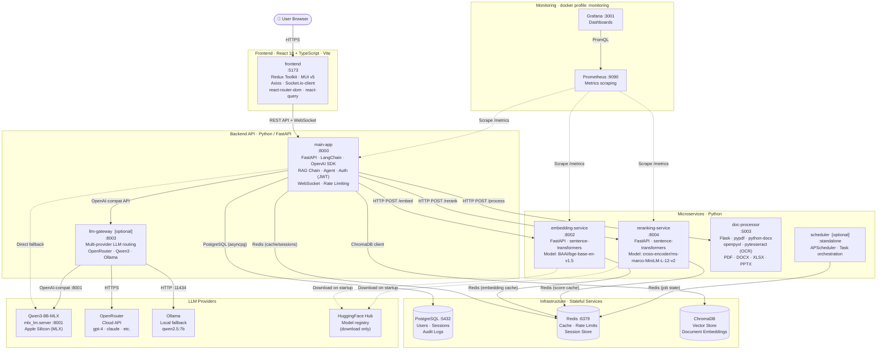

# Drass System Dependency Map

> SSOT — Last updated: 2026-04-26

## Service Dependency Graph



---

## Layer Summary

| Layer | Services | Ports | Key Tech |
|-------|----------|-------|----------|
| **Frontend** | frontend | 5173 | React 18, Redux Toolkit, MUI, Socket.io |
| **Backend API** | main-app | 8000 | FastAPI, LangChain, OpenAI SDK, JWT |
| **Backend API** | llm-gateway *(opt)* | 8003 | FastAPI, multi-provider LLM routing |
| **Microservices** | embedding-service | 8002 | sentence-transformers, BAAI/bge |
| **Microservices** | reranking-service | 8004 | sentence-transformers, cross-encoder |
| **Microservices** | doc-processor | 5003 | Flask, pypdf, pytesseract |
| **Microservices** | scheduler *(opt)* | — | APScheduler |
| **Infrastructure** | PostgreSQL | 5432 | User data, audit logs |
| **Infrastructure** | Redis | 6379 | Cache, sessions, rate limits |
| **Infrastructure** | ChromaDB | 8000 | Vector store (document embeddings) |
| **LLM** | Qwen3-8B-MLX | 8001 | mlx_lm.server, Apple Silicon |
| **LLM** | OpenRouter | HTTPS | Cloud: GPT-4, Claude, etc. |
| **LLM** | Ollama | 11434 | Local alternative |
| **Monitoring** | Prometheus | 9090 | Metrics scraping |
| **Monitoring** | Grafana | 3001 | Dashboards (depends on Prometheus) |

---

## Hard Dependencies (docker `depends_on`)

```
frontend         → main-app
main-app         → postgres, redis, chromadb, embedding-service, reranking-service, doc-processor
embedding-service → redis
reranking-service → redis, postgres
llm-gateway      → redis
grafana          → prometheus
```

---

## Legend

| Arrow | Meaning |
|-------|---------|
| `→` (solid) | Runtime hard dependency |
| `-.->` (dashed) | Optional / one-time / fallback |
